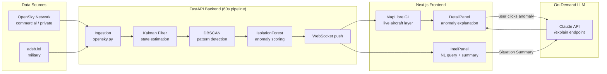

# AeroIntel

**Real-time aviation intelligence platform** — Kalman filtering for state estimation, DBSCAN clustering for behavioral pattern detection, and Claude-powered natural language querying and anomaly explanation, running against live ADS-B telemetry from 10,000+ aircraft.

> Built by Chris Schmidt | [pcschmidt.github.io](https://pcschmidt.github.io)

---

## Live Demo

[aerointel-git-main-chris-schmidts-projects.vercel.app](https://aerointel-git-main-chris-schmidts-projects.vercel.app)

---

## Architecture

### Pipeline



### Directory

```
aerointel/
├── backend/                  # FastAPI + Python ML pipeline
│   ├── main.py               # API server, routes, WebSocket
│   ├── services/
│   │   ├── opensky.py        # ADS-B ingestion from OpenSky Network
│   │   ├── kalman.py         # Kalman filter — position & velocity estimation
│   │   ├── clustering.py     # DBSCAN trajectory pattern detection
│   │   ├── anomaly.py        # IsolationForest anomaly detection
│   │   └── llm.py            # Claude API — summarization, NL query, explanation
│   ├── models/
│   │   └── schemas.py        # Pydantic data models
│   └── requirements.txt
├── frontend/                 # Next.js + MapLibre GL
│   ├── src/
│   │   ├── app/
│   │   │   └── page.tsx      # Main dashboard
│   │   ├── components/
│   │   │   ├── Map.tsx        # MapLibre GL map + layers
│   │   │   ├── AircraftLayer.tsx
│   │   │   ├── IntelPanel.tsx # AI summary + NL query panel
│   │   │   ├── DetailPanel.tsx # Click-to-inspect aircraft detail
│   │   │   └── AlertBanner.tsx # Anomaly alerts
│   │   ├── hooks/
│   │   │   ├── useAircraftData.ts
│   │   │   └── useWebSocket.ts
│   │   └── lib/
│   │       └── api.ts
│   └── package.json
└── docker-compose.yml
```

## Performance

Measured on the live Fly.io deployment (April 2026):

| Metric | Value |
|--------|-------|
| Aircraft tracked | 10,493 |
| Military aircraft | 268 |
| Pipeline cycle time | 3.5s |
| WebSocket push latency | <100ms |
| IsolationForest min fleet | 30 aircraft |
| Claude explanation latency | 2–4s (on-demand) |

*Anomaly rate, explanation sample outputs, and map screenshots available in `evidence/`.*

---

## Engineering Decisions

### Why Kalman Filtering?

ADS-B position updates arrive every 5–10 seconds. Linear interpolation between updates produces jerky, unrealistic motion. The Kalman filter maintains a **state estimate** (position + velocity) and a **covariance matrix** (uncertainty), producing smooth position predictions between updates and handling dropped packets gracefully.

The implementation uses a constant-velocity model: state vector `[lat, lon, dlat, dlon]`, with measurement noise tuned to typical ADS-B accuracy (~10m). This is the same family of algorithms used in actual avionics.

### Why DBSCAN for Pattern Detection?

Holding patterns and ISR racetrack orbits are **density-based clusters in trajectory space** — the aircraft visits the same geographic region repeatedly. DBSCAN (Density-Based Spatial Clustering of Applications with Noise) is ideal because:

- No need to specify k (number of clusters) in advance
- Naturally handles the "noise" of normal transit flight paths
- Works with a Haversine distance metric for geographic data
- Identifies arbitrary shapes (circles, ovals, racetracks)

K-means would require knowing how many patterns to look for and assumes spherical clusters — wrong on both counts.

### Why IsolationForest for Anomaly Detection?

Flight behavior anomalies are **rare events in high-dimensional space** (altitude, speed, heading variance, squawk history, climb rate). IsolationForest works by isolating observations via random partitioning — anomalies require fewer splits to isolate. It's computationally efficient for streaming data and requires no labeled "anomalous" examples.

Features used: altitude delta, speed delta, heading variance over 5-minute window, time-since-last-update, squawk code change frequency.

### Why LLM Reasoning Instead of Rule-Based Alerts?

Rule-based systems (`if squawk == 7700: alert`) catch known unknowns. LLMs catch unknown unknowns — they can synthesize multiple weak signals (unusual altitude + unusual routing + unusual squawk history) into a coherent explanation that a rule engine would miss. The Claude API integration uses **structured prompting** that passes current aircraft state as JSON and asks for both a classification and a plain-English explanation.

---

## Data Sources

| Source | Data | Rate Limit | Key Required |
|--------|------|-----------|-------------|
| [OpenSky Network](https://opensky-network.org) | Commercial + private flights | 100 req/day anonymous | Optional |
| [adsb.lol](https://adsb.lol) | Military aircraft | Unlimited | No |
| [FAA N-Number Registry](https://registry.faa.gov) | Aircraft owner lookup | Generous | No |
| [Anthropic Claude API](https://anthropic.com) | NL query + summarization | Per token | **Yes** |

---

## Setup

### Prerequisites
- Node.js 18+
- Python 3.11+ (tested through 3.13)
- Docker Desktop (optional but recommended)

### Quick Start

```bash
# Clone and enter
git clone https://github.com/PCSchmidt/aerointel.git
cd aerointel

# Backend
cd backend
python -m venv venv
source venv/bin/activate  # Windows: venv\Scripts\activate
pip install -r requirements.txt
cp .env.example .env      # Add your ANTHROPIC_API_KEY

# Frontend
cd ../frontend
npm install
cp .env.local.example .env.local

# Run both (from root)
docker compose up -d
# OR run separately:
# Terminal 1: cd backend && uvicorn main:app --reload
# Terminal 2: cd frontend && npm run dev
```

Open [http://localhost:3000](http://localhost:3000)

---

## Related Work

This project applies concepts from graduate-level coursework in:
- **Reinforcement Learning** — MDP formulation of flight path optimization
- **Bayesian Networks** — probabilistic destination inference from heading/position priors  
- **Linear Algebra** — Kalman filter covariance update (the math behind the smoothing)
- **Unsupervised ML** — DBSCAN clustering on geospatial trajectory data

---

## License

MIT